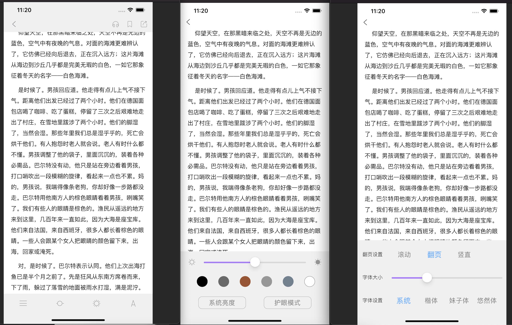

## （⚠️⚠️⚠️项目并没有完成✅发布，现在只能本地Pods使用⚠️⚠️⚠️）

## Ebook

使用Swift写的电子书阅读器，支持epub和txt格式，使用coretext解析文本和图片

## 项目截图

## 

## 支持特性

-  目前支持ePub、Txt格式电子书
- 支持ePub，Txt完整解析。可单独作为解析使用。
-  自定义字体、自定义文本。
-  主题设置、修改阅读背景颜色。
-  识别文本链接🔗。
- 支持语音朗读文本内容。
-  支持跳转翻页。
-  支持横向、竖向翻页滚动。
- 其他功能可下载体验。

## 如何使用?

```swift
let book = JMBookParse(path)
book.pushReader(pushVC: self)
```

遵循协议
```swift
extension XXXXXX-Class: JMBookProtocol {    
    func showGADView(_ after: Bool) -> UIViewController? {
        return nil
    }
    
    func bottomGADView(_ size: CGSize) -> UIView? {
        return UIView(frame: CGRect.Rect(size.width, size.height))
    }
    
    func openSuccess(_ desc: String) {
        SRToast.toast("😀😀😀打开 \(desc)成功")
    }
    
    func openFailed(_ desc: String) {
        SRToast.toast(desc)
    }
}
```
## 安装

### Cocoapods（⚠️⚠️⚠️项目并没有完成✅现在只是本地Pods使用）

```
source 'https://github.com/CocoaPods/Specs.git'
platform :ios, '9.0'
use_frameworks!

target '<Your Target Name>' do
    # pod 'JMEpubReader'
    pod 'JMEpubReader', :path=>'~/你的路径/JMEpubReader'
end
```

运行pod 命令

```
$ pod install
```
